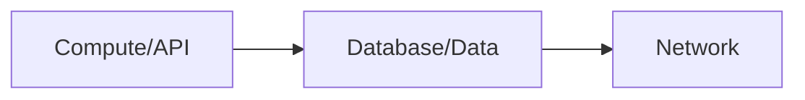
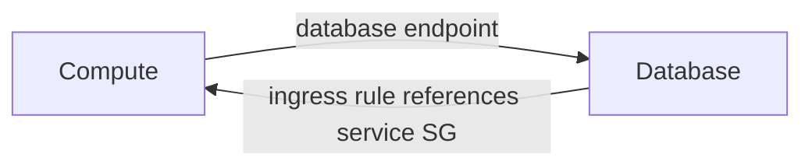

# AWS CDK Cyclic Dependency Patterns in TypeScript

Reproducible AWS CDK and CloudFormation dependency failures, followed by
solutions whose synthesized graphs are tested and validated.

The repository accompanies the article **Overcoming Cyclic Dependencies in AWS
CDK with TypeScript**. It focuses on the generated CloudFormation graph rather
than treating `addDependency()` as a universal fix.

## Scenarios

| Scenario | Problem | Solution |
|---|---|---|
| [S3 → Lambda notification](lib/s3-lambda/) | Bucket notification, function role, and bucket policy form a same-template cycle | Defer notification configuration with CDK's `Custom::S3BucketNotifications` L2 behavior |
| [ECS → Aurora security groups](lib/security-groups/) | Compute imports the DB endpoint while a DB-owned rule imports the service SG | Put the rule in the existing consumer stack, or in a downstream connectivity stack |
| [Cross-stack export deadlock](lib/export-deadlock/) | A strong export cannot be removed while a deployed consumer imports it | Migrate `STRONG → BOTH → WEAK`, then remove the reference |

## Dependency model

An arrow means “depends on.” A valid stack graph has one direction:



The invalid cross-stack security-group example closes the graph:



The fix changes **resource ownership**, not merely deployment order.

## Requirements

- Node.js 20 or newer
- npm
- AWS CLI v2
- An AWS profile for the read-only validation calls

The examples use:

- `aws-cdk-lib` 2.267.0
- `aws-cdk` CLI 2.1139.0
- TypeScript 5.9.2

## Install

```bash
npm ci
```

## Local checks

```bash
npm run build
npm test
npm run synth:solutions
```

The tests assert both sides of the examples:

- the low-level S3 template contains a detectable resource cycle;
- the security-group problem produces CDK's cyclic-reference annotation;
- the corrected SG rule is emitted in `ComputeStack` or `ConnectivityStack`;
- the S3 solution uses `Custom::S3BucketNotifications`;
- strong, transitional, and weak export phases synthesize the expected
  `Fn::ImportValue` and `Fn::GetStackOutput` mechanisms.

## Validate against an AWS profile

The validation script authenticates with the selected profile, compiles and
tests the code, synthesizes the stacks, and sends the templates to the
CloudFormation `ValidateTemplate` API.

```bash
AWS_PROFILE=dev-academy npm run validate:aws
```

It also confirms that the two intentional problem cases fail in the expected
way:

- CloudFormation rejects the S3/Lambda template with `Circular dependency
  between resources`.
- CDK rejects the security-group app with `would create a cyclic reference`.

### Safety

`validate:aws` does **not** bootstrap, deploy, update, or delete any AWS stack.
It calls STS `GetCallerIdentity` and CloudFormation `ValidateTemplate` only.

The solution stacks contain resources that can incur charges if you deploy
them, including Aurora Serverless v2 and ECS Fargate. Review every template and
`cdk diff` before any manual deployment.

## Individual commands

### S3 and Lambda

```bash
AWS_PROFILE=dev-academy npm run synth:s3:problem
AWS_PROFILE=dev-academy npm run synth:s3:solution
```

### Cross-stack security groups

```bash
# Expected to fail: the graph is intentionally cyclic.
AWS_PROFILE=dev-academy npm run synth:sg:problem

# Consumer-owned relationship resource.
AWS_PROFILE=dev-academy npm run synth:sg:solution

# Dedicated downstream relationship stack.
AWS_PROFILE=dev-academy npm run synth:sg:connectivity
```

### Export migration phases

```bash
AWS_PROFILE=dev-academy npm run synth:export:strong
AWS_PROFILE=dev-academy npm run synth:export:both
AWS_PROFILE=dev-academy npm run synth:export:weak
```

The three export commands use the same CloudFormation stack names so their
templates model phased updates to one deployment. The repository intentionally
does not automate those deployments.

## Repository layout

```text
.
├── bin/                         # CDK entrypoints
├── lib/
│   ├── common/                  # Environment helpers
│   ├── export-deadlock/         # Strong/Both/Weak migration
│   ├── s3-lambda/               # Same-template resource cycle
│   ├── security-groups/         # Cross-stack rule ownership
│   └── testing/                 # CloudFormation graph cycle detector
├── scripts/validate-aws.sh      # Read-only AWS validation
└── test/                        # CDK assertion tests
```

## Principles demonstrated

1. Inspect the synthesized graph, not only the TypeScript call site.
2. Put cross-stack relationship resources in an existing downstream stack.
3. Use a third integration stack only when it remains downstream of both
   resource owners.
4. Split stacks by lifecycle and deployment boundary, not one AWS service per
   stack.
5. Treat removal of strong exports as a migration with intermediate states.
6. Test resource placement and reference strength as architectural behavior.

## References

- [AWS CloudFormation `DependsOn`](https://docs.aws.amazon.com/AWSCloudFormation/latest/TemplateReference/aws-attribute-dependson.html)
- [AWS CDK cross-stack references](https://docs.aws.amazon.com/cdk/v2/guide/resources.html)
- [AWS CDK EC2 cross-stack connections](https://docs.aws.amazon.com/cdk/api/v2/python/aws_cdk.aws_ec2/README.html#cross-stack-connections)
- [AWS CDK `ReferenceStrength`](https://docs.aws.amazon.com/cdk/api/v2/docs/aws-cdk-lib.ReferenceStrength.html)
- [Handling circular dependency errors in CloudFormation](https://aws.amazon.com/blogs/infrastructure-and-automation/handling-circular-dependency-errors-in-aws-cloudformation/)

## License

MIT
