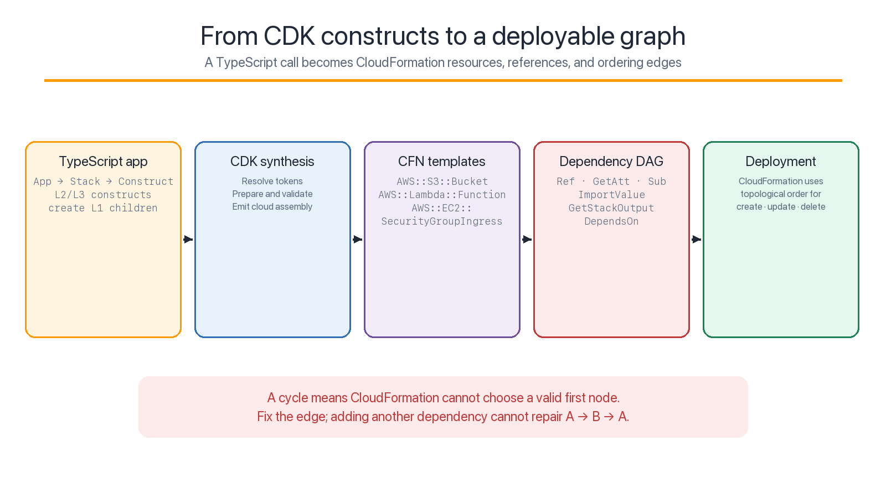
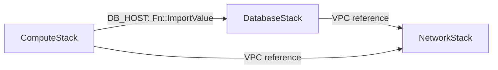
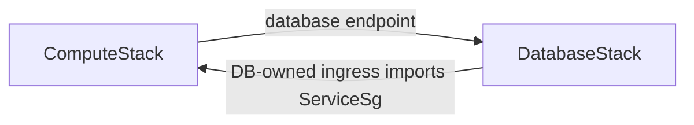

# AWS CDK cyclic dependency patterns in TypeScript

[](https://github.com/proton0210/aws-cdk-cyclic-dependency-patterns/actions/workflows/ci.yml)

This repository turns three common “cyclic dependency” failures into
reproducible AWS CDK examples. Each scenario contains an intentionally broken
implementation, a corrected dependency graph, construct-level documentation,
and tests that inspect the synthesized CloudFormation behavior.

The examples accompany the AWS Builder Center article
[**Overcoming Cyclic Dependencies in AWS CDK with TypeScript**](https://builder.aws.com/content/3Il5J6C4XSfW0RbRzyMuUgxTEkf/overcoming-cyclic-dependencies-in-aws-cdk).
They were compiled against `aws-cdk-lib` 2.267.0 and validated with an isolated
test identity without deploying resources. No AWS profile name or credential is
stored in this repository.

> A cycle is a graph problem. Fix it by removing, deferring, reversing, or
> externalizing an edge. `addDependency()` only adds another edge.



## Problems and implemented solutions

**Every failure demonstrated in this repository has runnable TypeScript solution
code.** The problem implementations remain isolated behind their own
entrypoints, while the default application synthesizes only valid solutions.

| Scenario | Problem implementation | Implemented solution | Run the solution |
|---|---|---|---|
| [S3 notification and Lambda](lib/s3-lambda/) | [`problem-stack.ts`](lib/s3-lambda/problem-stack.ts) creates a CloudFormation resource cycle | [`solution-stack.ts`](lib/s3-lambda/solution-stack.ts) defers notification mutation with `Custom::S3BucketNotifications` | `npm run synth:s3:solution` |
| [ECS, Aurora, and security groups](lib/security-groups/) | [`buildSecurityGroupProblemApp()`](lib/security-groups/apps.ts) creates a cross-stack cycle | [`buildSecurityGroupSolutionApp()`](lib/security-groups/apps.ts) puts both rules in the consumer; [`ConnectivityStack`](lib/security-groups/connectivity-stack.ts) provides a downstream-owner alternative | `npm run synth:sg:solution` or `npm run synth:sg:connectivity` |
| [Cross-stack export removal](lib/export-deadlock/) | `ReferenceStrength.STRONG` models the export contract that can deadlock a later update | [`stacks.ts`](lib/export-deadlock/stacks.ts) and the phase entrypoints implement the `STRONG → BOTH → WEAK` migration | `npm run synth:export:strong`, then `both`, then `weak` |

The solutions change the dependency graph rather than suppressing an error:

- the S3 solution defers a relationship until both endpoints and permission
  exist;
- the security-group solutions move relationship-resource ownership downstream;
- the export solution migrates the deployed reference contract in three ordered
  phases.

Run `npm run synth:all:valid` to synthesize every valid solution. Run `npm test`
to verify the generated resource ownership and reference mechanisms.

The scenarios are deliberately different. The first is a resource cycle inside
one template, the second is a cycle between CDK stacks, and the third is a
transition deadlock between two otherwise valid deployed states.

## The dependency model

An arrow in the documentation means **depends on**. If `ComputeStack` embeds the
Aurora endpoint from `DatabaseStack`, the direction is:



This is a directed acyclic graph. The failing security-group method call adds
the reverse edge:



Runtime traffic arrows can point in both directions without causing a deployment
cycle. What matters is the generated CloudFormation ownership and references.

## Repository map

```text
.
├── bin/                         # One CDK entrypoint per problem or solution
├── docs/
│   ├── article.md               # Repository-aligned long-form article
│   └── diagrams/                # Static PNG diagrams and their generator
├── lib/
│   ├── common/                  # CLI environment helper
│   ├── export-deadlock/         # DataStack and ApiStack migration phases
│   ├── s3-lambda/               # Same-template resource cycle
│   ├── security-groups/         # Network, database, compute, and edge stacks
│   └── testing/                 # CloudFormation resource-cycle detector
├── scripts/validate-aws.sh      # Read-only AWS validation
└── test/                        # CDK assertion and graph tests
```

Every scenario directory has its own README with:

- the runtime requirement;
- the CDK constructs and generated CloudFormation resources;
- the exact failing dependency edges;
- the corrected graph and code location;
- commands and expected results.

## Requirements

- Node.js 20 or newer; CI uses Node.js 22
- npm
- AWS CLI v2 for AWS-backed template validation
- `rg` (ripgrep), used by the validation script
- AWS credentials and a Region resolved by the standard AWS provider chain,
  with permission for `sts:GetCallerIdentity` and
  `cloudformation:ValidateTemplate`

The exact package versions are locked in `package-lock.json`:

- `aws-cdk-lib` 2.267.0
- `aws-cdk` CLI 2.1139.0
- TypeScript 5.9.2

## Install and run local checks

```bash
npm ci
npm run check
```

`npm run check` performs repository-policy validation, a strict TypeScript
build, tests with coverage thresholds, and credential-independent synthesis of
every valid solution. Without an AWS credential source, the entrypoints create
environment-agnostic stacks so CI does not depend on a local `cdk.context.json`
file. When `--profile` is supplied directly to a standalone CDK command, the CDK
CLI can provide the selected account and Region at the application boundary.

## Validate with AWS credentials

```bash
# Use the standard AWS credential provider chain.
npm run validate:aws

# Or select any locally configured named profile.
AWS_PROFILE=my-test-profile npm run validate:aws
```

`AWS_PROFILE` is optional and is supplied by the caller. The repository never
provides, persists, or assumes a particular profile.

The validation script deliberately synthesizes environment-agnostic templates,
even when AWS credentials are available. This prevents account-specific CDK
context lookups and keeps AWS access limited to STS identity verification and
CloudFormation template validation.

The script performs the following checks:

1. Calls STS `GetCallerIdentity` to confirm the selected credentials work.
2. Compiles the TypeScript and runs all tests.
3. Synthesizes every solution stack.
4. Calls CloudFormation `ValidateTemplate` for each valid template.
5. Confirms that the S3/Lambda problem fails with `Circular dependency between
   resources`.
6. Confirms that the security-group problem fails synthesis with `would create
   a cyclic reference`.
7. Synthesizes and validates the strong, both, and weak export phases.

### Safety boundary

`validate:aws` does **not** bootstrap, deploy, update, or delete stacks. It only
uses STS and CloudFormation template validation.

The examples include resources that incur charges if manually deployed,
including Aurora Serverless v2 and ECS Fargate. The stateful example resources
also use destructive removal policies to make a disposable lab easier to clean
up. Do not copy those lifecycle settings into production without an explicit
data-retention decision.

## Commands by scenario

### S3 and Lambda

```bash
npm run synth:s3:problem
npm run synth:s3:solution
```

The problem synthesizes a template, but CloudFormation validation rejects that
template. See [the S3/Lambda walkthrough](lib/s3-lambda/).

### Cross-stack security groups

```bash
# Expected CDK synthesis failure.
npm run synth:sg:problem

# ComputeStack owns ingress and egress relationship resources.
npm run synth:sg:solution

# A downstream ConnectivityStack owns both relationship resources.
npm run synth:sg:connectivity
```

See [the ECS/Aurora walkthrough](lib/security-groups/).

### Export migration

```bash
npm run synth:export:strong
npm run synth:export:both
npm run synth:export:weak
```

All three entrypoints use the same CloudFormation stack names so the templates
model updates to one deployed application. The repository does not deploy the
migration automatically. See [the export walkthrough](lib/export-deadlock/).

## Tests as architectural guardrails

The tests verify generated behavior rather than only checking that constructors
return successfully:

- the L1 S3 template contains a detectable resource cycle;
- the L2 S3 solution contains one `Custom::S3BucketNotifications` resource and
  no resource cycle;
- the security-group problem exposes CDK's cyclic-reference annotation;
- the consumer-owned solution emits PostgreSQL ingress and egress rules in
  `ComputeStack`, not `DatabaseStack`;
- the connectivity solution emits both rules in `ConnectivityStack` and
  synthesizes without a stack cycle;
- strong references contain `Export` and `Fn::ImportValue`;
- `BOTH` retains the export while the consumer uses `Fn::GetStackOutput`;
- `WEAK` removes the export lock.

Coverage thresholds are enforced at 95% for statements and lines, 95% for
functions, and 80% for branches.

## Design rules demonstrated

1. Inspect the synthesized resource and stack graph, not only TypeScript call
   order.
2. Keep cohesive resources in one construct or stack unless deployment
   lifecycle requires a split.
3. Treat permissions, notifications, subscriptions, routes, and security-group
   rules as relationship resources with explicit owners.
4. Put a cross-stack relationship in the stack already downstream of the
   referenced resource.
5. If neither endpoint should own the relationship, use a third stack that
   remains downstream of both.
6. Treat removal of a strong export as a multi-deployment migration.
7. Assert reference mechanisms and resource placement in tests.

## Primary references

- [AWS CDK resources and cross-stack reference strength](https://docs.aws.amazon.com/cdk/v2/guide/resources.html)
- [AWS CDK best practices](https://docs.aws.amazon.com/cdk/v2/guide/best-practices.html)
- [AWS CDK EC2 cross-stack connections](https://docs.aws.amazon.com/cdk/api/v2/python/aws_cdk.aws_ec2/README.html#cross-stack-connections)
- [CloudFormation `DependsOn`](https://docs.aws.amazon.com/AWSCloudFormation/latest/TemplateReference/aws-attribute-dependson.html)
- [CloudFormation `Fn::ImportValue`](https://docs.aws.amazon.com/AWSCloudFormation/latest/TemplateReference/intrinsic-function-reference-importvalue.html)
- [CloudFormation `Fn::GetStackOutput`](https://docs.aws.amazon.com/AWSCloudFormation/latest/TemplateReference/intrinsic-function-reference-getstackoutput.html)
- [AWS guidance for CloudFormation circular dependencies](https://aws.amazon.com/blogs/infrastructure-and-automation/handling-circular-dependency-errors-in-aws-cloudformation/)

## Contributing

Issues, scenario proposals, discussions, documentation improvements, and pull
requests are welcome. Start with [CONTRIBUTING.md](CONTRIBUTING.md), follow the
[Code of Conduct](CODE_OF_CONDUCT.md), and use private vulnerability reporting
for security-sensitive findings.

Contributor changes must use a protected pull-request workflow: accepted design
context when required, valid branch and title formats, repository policy checks,
build/tests/synthesis, resolved review conversations, and code-owner approval.
Project roles and the narrow administrative-bypass policy are defined in
[GOVERNANCE.md](GOVERNANCE.md).

New scenarios should include an intentionally failing implementation, a
construct-level explanation of the cycle, a corrected acyclic graph, and tests
that inspect the synthesized behavior.

## License

MIT
