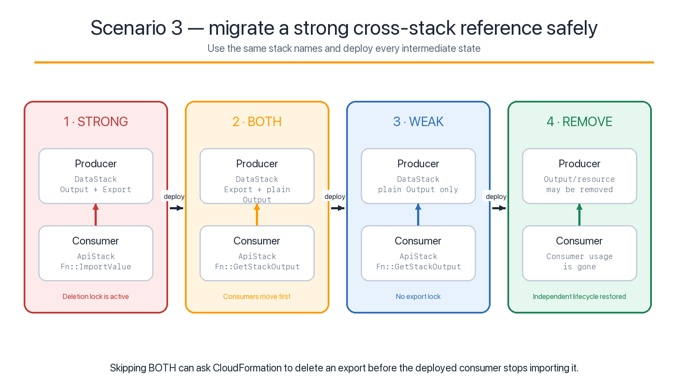
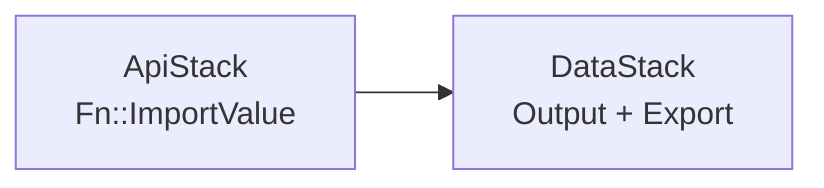
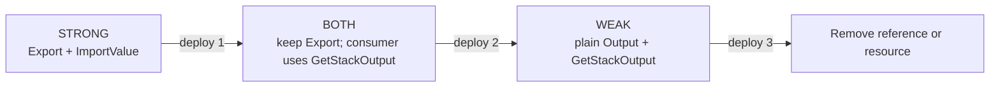

# Scenario 3: cross-stack export removal deadlock

This scenario models a failure that appears during an update, not during the
initial synthesis or deployment.



## Construct inventory

Source: [`stacks.ts`](stacks.ts)

| Stack | Constructs | Cross-stack values |
|---|---|---|
| `ExportMigration-Data` | DynamoDB `Table` | Table name and ARN produced by the table |
| `ExportMigration-Api` | Lambda `Function`, IAM grant | `TABLE_NAME` and policy resources consume table attributes |

The application selects the producer-side mechanism with:

```ts
CrossStackReferences.of(this.table).produce(referenceStrength);
```

## Why the strong state can deadlock during removal

The default `STRONG` reference is valid:



CloudFormation protects referential integrity. While a deployed stack imports
an export, the producer cannot delete the export or change its value.

The deadlock appears when one code change removes both the consumer use and the
automatically generated producer export. If the producer update is attempted
while the old consumer template is still deployed, CloudFormation rejects it:

```text
Export ... cannot be deleted as it is in use by ExportMigration-Api
```

This is a transition between graph states. Both the old and final states can be
valid while the direct update between them is not.

## Safe migration

Use the same stack names and make each phase a separate reviewed deployment:

| Phase | Producer template | Consumer template | Purpose |
|---|---|---|---|
| `STRONG` | Plain output plus `Export` | `Fn::ImportValue` | Initial referential integrity |
| `BOTH` | Keeps `Export` and plain output | Switches to `Fn::GetStackOutput` | Move consumers without deleting the old producer contract |
| `WEAK` | Plain output; no export lock | `Fn::GetStackOutput` | Remove strong coupling after consumers move |
| Remove | Output/resource may be removed | Consumer usage may be removed | Complete the lifecycle change |



Synthesize the three repository states:

```bash
AWS_PROFILE=dev-academy npm run synth:export:strong
AWS_PROFILE=dev-academy npm run synth:export:both
AWS_PROFILE=dev-academy npm run synth:export:weak
```

These commands intentionally do not deploy. In a real migration, run and review
`cdk diff` for every phase, then deploy that phase completely before editing the
next one.

## Weak-reference trade-off

`Fn::GetStackOutput` resolves the producer's output when the consumer stack is
created or updated. It does not create an export lock, so the producer can be
deleted independently. That freedom removes referential integrity:

- a later consumer update fails if the producer stack or output no longer
  exists;
- changing the producer output does not automatically update consumers;
- cross-account use requires a narrowly scoped role with permission to describe
  the producer stack;
- current CloudFormation placement limitations for `Fn::GetStackOutput` still
  apply.

Use `WEAK` because independent lifecycle is a requirement, not simply to avoid
an inconvenient deployment failure.

## Compatibility fallback

On older CDK releases without reference-strength controls, preserve the
automatic export temporarily with `stack.exportValue(attribute)`, deploy the
consumer removal first, and remove the retained export only after
`list-imports` is empty.

Do not invent a replacement export name. `exportValue()` is intended to retain
the export for the original token.

## Validation assertions

[`test/export-deadlock.test.ts`](../../test/export-deadlock.test.ts) inspects
both synthesized templates for every phase:

- `STRONG` contains `Export` and `Fn::ImportValue`;
- `BOTH` preserves `Export`, uses `Fn::GetStackOutput`, and removes
  `Fn::ImportValue` from the consumer;
- `WEAK` uses `Fn::GetStackOutput` and contains no export lock.

All six phase templates are also sent to CloudFormation `ValidateTemplate` by
`npm run validate:aws`.
