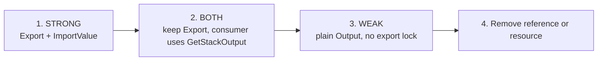

# Scenario 3: cross-stack export deadlock

## Problem state: a strong reference

`DataStack` owns a DynamoDB table. `ApiStack` consumes the table name and ARN.
The default strong reference emits a CloudFormation export in the producer and
`Fn::ImportValue` in the consumer.

```bash
AWS_PROFILE=dev-academy npm run synth:export:strong
```

Both templates are valid. The failure appears later if one deployment attempts
to remove the consumer reference and the producer's automatically generated
export. CloudFormation rejects the producer update while the deployed consumer
still imports the value.

## Solution: migrate the reference before removing it

Recent CDK versions provide a transitional `BOTH` reference strength and a
`WEAK` strength backed by `Fn::GetStackOutput`.



Synthesize each migration phase:

```bash
AWS_PROFILE=dev-academy npm run synth:export:strong
AWS_PROFILE=dev-academy npm run synth:export:both
AWS_PROFILE=dev-academy npm run synth:export:weak
```

For a real deployed system, deploy each phase separately and review `cdk diff`
before proceeding. This repository never deploys those phases automatically.

Weak references deliberately relax referential integrity: the producer may be
deleted while a consumer still contains the old value. Use them only when that
lifecycle independence is intentional.
