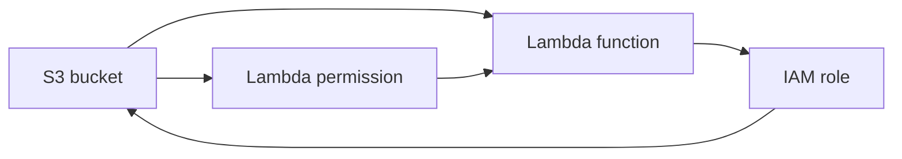

# Scenario 1: S3 notification and Lambda

## Problem

The low-level template creates this resource graph:



The bucket's inline notification needs the function. The function needs a role,
and the role policy needs the bucket ARN. CloudFormation cannot choose a first
resource.

```bash
AWS_PROFILE=dev-academy npm run synth:s3:problem
aws cloudformation validate-template \
  --profile dev-academy \
  --template-body file://"$PWD/cdk.out/problems/s3-lambda/Problem-S3LambdaCycle.template.json"
```

The second command is expected to return `Circular dependency between
resources`.

## Solution

Use the S3 and Lambda L2 constructs. CDK emits a
`Custom::S3BucketNotifications` resource and applies the notification after the
bucket, function, and permission exist.

```bash
AWS_PROFILE=dev-academy npm run synth:s3:solution
```

The solution stack is deployable, but the repository validation scripts only
synthesize and call `ValidateTemplate`; they do not deploy it.
