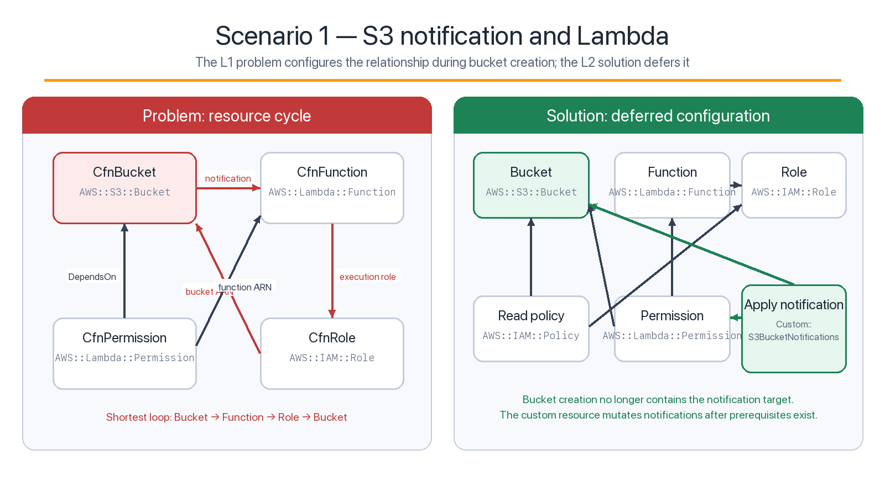
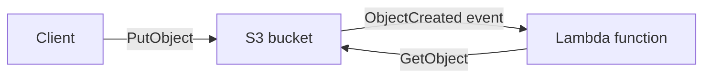
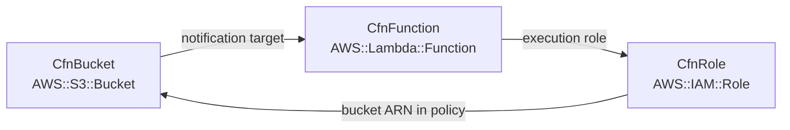
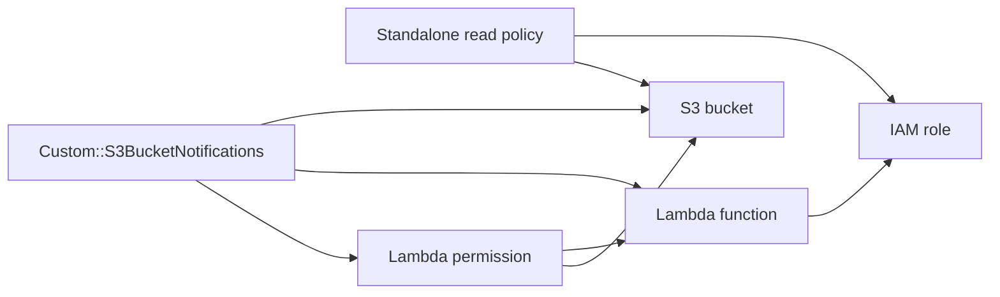

# Scenario 1: S3 notification and Lambda

This scenario reproduces a CloudFormation resource cycle inside one stack and
then removes the cycle by changing when the S3 notification relationship is
applied.



## Runtime requirement

An S3 bucket invokes a Lambda function for object-created events. The function
must also read objects from that bucket.

Runtime traffic is allowed to be bidirectional:



The failure is in the **deployment** graph, not this runtime flow.

## Problem implementation

Source: [`problem-stack.ts`](problem-stack.ts)

| TypeScript construct or operation | Synthesized behavior | Dependency introduced |
|---|---|---|
| `CfnBucket` with inline `notificationConfiguration` | `AWS::S3::Bucket` contains the Lambda ARN | Bucket → Function |
| `CfnFunction` | `AWS::Lambda::Function.Role` uses the role ARN | Function → Role |
| `CfnRole` with an inline read policy | `AWS::IAM::Role` policy contains the bucket ARN | Role → Bucket |
| `CfnPermission` | Permission contains function and bucket ARNs | Permission → Function and Bucket |
| `bucket.addResourceDependency(permission)` | Explicit `DependsOn` | Bucket → Permission |

The shortest closed path is:



CloudFormation cannot choose a first resource. Adding more `DependsOn` edges
cannot break this loop.

### Reproduce it

```bash
npm run synth:s3:problem

aws cloudformation validate-template \
  --template-body \
  file://"$PWD/cdk.out/problems/s3-lambda/Problem-S3LambdaCycle.template.json"
```

Synthesis succeeds because CDK can emit the L1 resources. CloudFormation
validation is expected to fail with `Circular dependency between resources`.

## Solution implementation

Source: [`solution-stack.ts`](solution-stack.ts)

The solution uses these L2 APIs:

```ts
const bucket = new Bucket(this, 'Uploads');
const handler = new LambdaFunction(this, 'Processor', {
  runtime: Runtime.NODEJS_22_X,
  handler: 'index.handler',
  code: Code.fromInline('exports.handler = async () => undefined;'),
});

bucket.grantRead(handler);
bucket.addEventNotification(
  EventType.OBJECT_CREATED,
  new LambdaDestination(handler),
);
```

This changes more than the TypeScript syntax. The constructs synthesize the
relationship as separate resources:

| CDK API | Important generated resources |
|---|---|
| `Bucket` | `AWS::S3::Bucket` without an inline Lambda target during creation |
| `Function` | `AWS::Lambda::Function` and execution role |
| `bucket.grantRead(handler)` | A standalone `AWS::IAM::Policy` that depends on the bucket and role |
| `LambdaDestination` | `AWS::Lambda::Permission` |
| `bucket.addEventNotification(...)` | `Custom::S3BucketNotifications` and its provider |

Conceptually:



The bucket is created without the notification target. The custom resource
applies the configuration only after the bucket, function, and invocation
permission exist. No path points back from the bucket's create-time properties
to the function.

### Validate it

```bash
npm run synth:s3:solution
npm test -- --runTestsByPath test/s3-lambda.test.ts
```

The test asserts that the solution contains one
`Custom::S3BucketNotifications` resource and that the synthesized template has
no resource cycle.

## Production considerations

- The custom resource needs permission to call
  `s3:PutBucketNotificationConfiguration`; review its synthesized IAM policy.
- Coordinate CDK-managed notifications with notifications managed outside this
  stack. Multiple writers to the bucket notification document can overwrite
  one another.
- A fixed bucket name can sometimes remove an attribute edge, but global name
  uniqueness and replacement behavior make that an architectural contract, not
  a generic cycle fix.
- The example uses destructive cleanup settings for a disposable lab. Choose
  retention and deletion protection deliberately in production.

## Relevant test and command files

- [`test/s3-lambda.test.ts`](../../test/s3-lambda.test.ts)
- [`bin/s3-lambda-problem.ts`](../../bin/s3-lambda-problem.ts)
- [`bin/s3-lambda-solution.ts`](../../bin/s3-lambda-solution.ts)
- [`lib/testing/dependency-graph.ts`](../testing/dependency-graph.ts)
