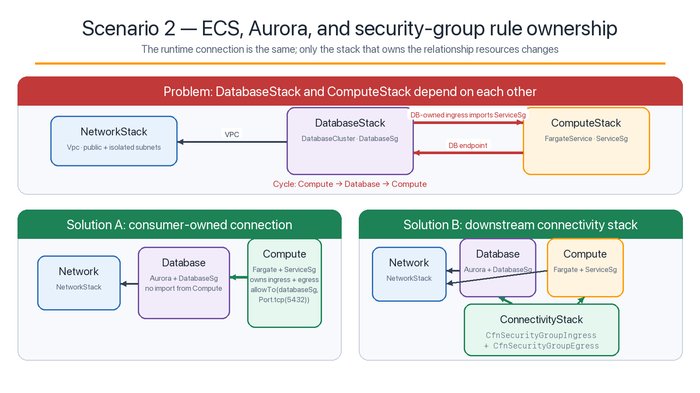
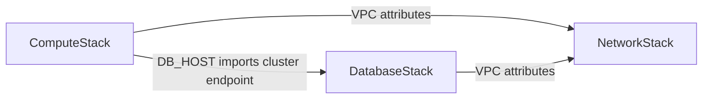
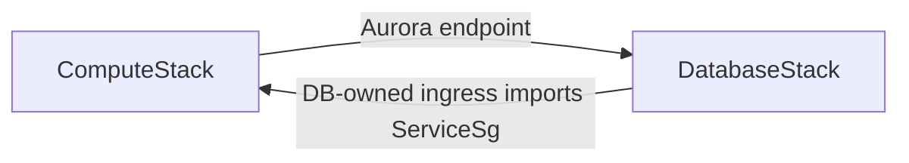
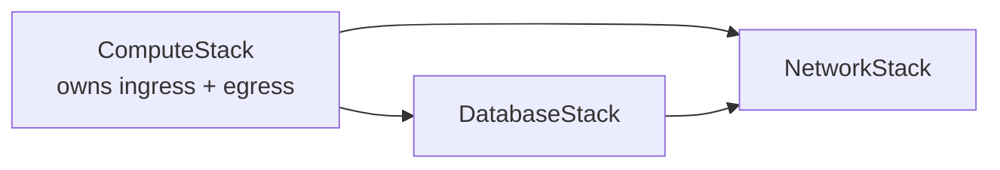
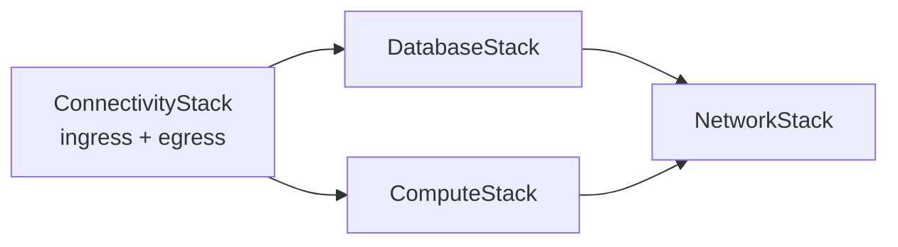

# Scenario 2: ECS, Aurora, and cross-stack security groups

This scenario shows how a method call on a security-group object can place
relationship resources in the wrong stack and close an otherwise valid
cross-stack graph.



## Runtime requirement

An ECS Fargate task connects to Aurora PostgreSQL on TCP port 5432. Only the
service security group may reach the database security group.

## Construct and stack inventory

| Stack | CDK constructs | Important CloudFormation resources |
|---|---|---|
| [`NetworkStack`](network-stack.ts) | `Vpc` with public and isolated subnets | VPC, subnets, route tables, internet gateway |
| [`DatabaseStack`](database-stack.ts) | `SecurityGroup`, `DatabaseCluster`, serverless v2 writer | Aurora cluster/instance, subnet group, `DatabaseSg` |
| [`ComputeStack`](compute-stack.ts) | `SecurityGroup`, ECS `Cluster`, `FargateTaskDefinition`, `FargateService` | ECS service/task definition, `ServiceSg`, IAM roles |
| [`ConnectivityStack`](connectivity-stack.ts) | `CfnSecurityGroupIngress`, `CfnSecurityGroupEgress` | Standalone PostgreSQL ingress and egress rules |

Both application stacks depend on `NetworkStack`. `ComputeStack` also places
the Aurora endpoint token in `DB_HOST`, which establishes
`ComputeStack → DatabaseStack`.



## Problem implementation

Source: [`apps.ts`](apps.ts), `buildSecurityGroupProblemApp()`.

After the valid compute-to-database reference exists, the composition root calls:

```ts
database.databaseSg.addIngressRule(
  compute.serviceSg,
  Port.tcp(5432),
  'Incorrect cross-stack rule ownership',
);
```

`databaseSg` belongs to `DatabaseStack`. With the default `remoteRule` behavior,
CDK parents the standalone ingress rule under that security group. The rule must
reference `ServiceSg`, so it adds `DatabaseStack → ComputeStack`.



The CDK detects the stack cycle during synthesis:

```bash
npm run synth:sg:problem
```

Expected result: `would create a cyclic reference`.

Calling `compute.addStackDependency(database)` cannot help because that direction
already exists. Calling `database.addStackDependency(compute)` would merely make
the reverse edge explicit.

## Solution A: the existing consumer owns the connection

Source: [`compute-stack.ts`](compute-stack.ts).

The compute stack already depends on the database, so it is the natural owner
of the relationship resources:

```ts
this.service.connections.allowTo(
  props.databaseSg,
  Port.tcp(5432),
  'ECS tasks to Aurora PostgreSQL',
);
```

For cross-stack peers, a call through `connections` puts both the ingress and
egress rules in the caller's stack. Here `ServiceSg` has
`allowAllOutbound: false`, so the PostgreSQL egress rule is required as well as
the database ingress rule.



There is still one runtime connection from ECS to Aurora, but only one
deployment dependency direction.

```bash
npm run synth:sg:solution
```

## Solution B: a downstream connectivity stack owns the connection

Source: [`connectivity-stack.ts`](connectivity-stack.ts).

When neither endpoint stack should own network policy, create a third stack
that imports both group IDs and emits both standalone rules:

```ts
new CfnSecurityGroupIngress(this, 'DatabaseFromService', {
  groupId: props.databaseSg.securityGroupId,
  sourceSecurityGroupId: props.serviceSg.securityGroupId,
  ipProtocol: 'tcp',
  fromPort: 5432,
  toPort: 5432,
});

new CfnSecurityGroupEgress(this, 'ServiceToDatabase', {
  groupId: props.serviceSg.securityGroupId,
  destinationSecurityGroupId: props.databaseSg.securityGroupId,
  ipProtocol: 'tcp',
  fromPort: 5432,
  toPort: 5432,
});
```



`ConnectivityStack` must remain downstream. If `DatabaseStack` or
`ComputeStack` consumes an output from it, the graph can close again.

```bash
npm run synth:sg:connectivity
```

## Choosing the owner

| Situation | Preferred ownership |
|---|---|
| Compute already consumes the DB endpoint, secret, or SG | `ComputeStack`; call `service.connections.allowTo(...)` |
| Neither endpoint team should own network policy | A downstream `ConnectivityStack` |
| Existing code must call `databaseSg.addIngressRule(...)` | Consider `remoteRule: true`, document why, and test the emitted template |
| The resources always deploy and change together | Keep them in one stack and model the capability as a higher-level construct |

The repository implements and tests the first two options. `remoteRule` is a
valid API feature but is not used here because call direction through
`connections` makes ownership clearer.

## Validation assertions

[`test/security-groups.test.ts`](../../test/security-groups.test.ts) verifies:

- the problem produces CDK's cyclic-reference annotation;
- the consumer-owned solution places the PostgreSQL ingress and egress in
  `ComputeStack`, not `DatabaseStack`;
- the connectivity solution contains both standalone rules and the full app
  synthesizes successfully.

## Production considerations

- This lab gives the Fargate tasks public IPs and uses public subnets solely to
  avoid NAT gateway cost in an optional test deployment. A production service
  commonly uses private subnets plus NAT or VPC endpoints.
- The service security group allows only HTTPS, VPC DNS, and the explicitly
  added database connection. If you add dependencies, add their required egress
  deliberately.
- Aurora Serverless v2 and Fargate incur charges if deployed. The repository's
  standard validation path does not deploy them.
