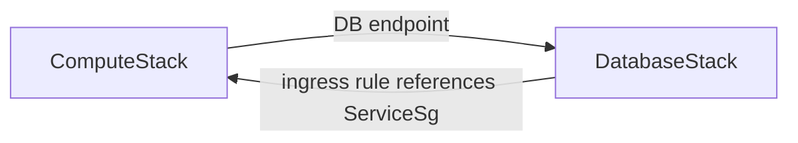

# Scenario 2: ECS and Aurora security groups across stacks

## Problem

`ComputeStack` uses the Aurora endpoint and therefore depends on
`DatabaseStack`. Calling `databaseSg.addIngressRule(serviceSg, ...)` creates the
new rule under `DatabaseStack`, adding the reverse edge.



```bash
AWS_PROFILE=dev-academy npm run synth:sg:problem
```

This command is expected to fail during CDK synthesis with `would create a
cyclic reference`.

## Solution A: the existing consumer owns the relationship

Call `service.connections.allowTo(databaseSg, Port.tcp(5432))` from
`ComputeStack`. CDK puts the ingress rule in the already-dependent stack.

```bash
AWS_PROFILE=dev-academy npm run synth:sg:solution
```

## Solution B: a downstream connectivity stack owns the relationship

When neither endpoint stack should own the rule, a third stack can depend on
both and create a standalone `AWS::EC2::SecurityGroupIngress` resource.

```bash
AWS_PROFILE=dev-academy npm run synth:sg:connectivity
```

The connectivity stack must stay downstream; it must not export values back to
the resource-owning stacks.
